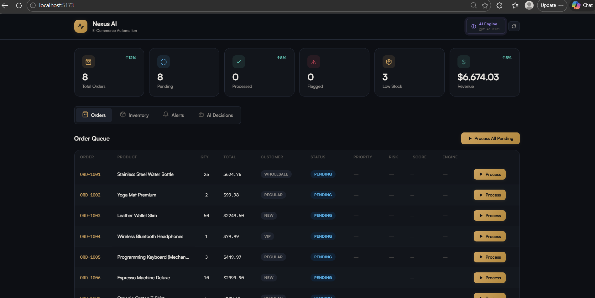

# 🧠 Nexus AI – E-Commerce Automation System

A full-stack AI-powered e-commerce automation platform that simulates real-world business workflows using a multi-agent architecture and LLM-based decision engine.

---

## 🚀 Features

* 🤖 AI-powered order processing using OpenAI
* 🧩 Multi-agent system (Order, Inventory, Notification)
* 📊 Real-time enterprise dashboard (React + Tailwind)
* ⚠️ Risk detection & priority classification
* 🔁 Rule-based fallback system (no AI dependency mode)
* 📦 Inventory tracking & low-stock alerts
* 🐳 Dockerized full-stack setup

---

## 🏗️ Architecture

```
React Dashboard (Vite)
        ↓
FastAPI Backend
        ↓
Multi-Agent System
        ↓
AI Decision Engine (OpenAI)
        ↓
Database (SQLite)
```

---

## 🧠 Agent Pipeline

```
Order → Order Processor → Inventory Manager → Notification Agent
```

* **Order Processor** → Classifies orders (AI or rules)
* **Inventory Manager** → Deducts stock + suggests restock
* **Notification Agent** → Generates alerts & logs

---

## 🛠️ Tech Stack

| Layer      | Technology                              |
| ---------- | --------------------------------------- |
| Frontend   | React, Vite, TailwindCSS, Framer Motion |
| Backend    | FastAPI, Python                         |
| AI         | OpenAI (gpt-4o-mini)                    |
| Database   | SQLite                                  |
| Deployment | Docker, Vercel, Render                  |

---

## ⚙️ Setup

### 🐳 Run with Docker (Recommended)

```bash
docker compose up --build
```

---

### 🔧 Manual Setup

#### Backend

```bash
cd backend
python -m venv venv
pip install -r requirements.txt
uvicorn main:app --reload
```

---

#### Frontend

```bash
cd frontend
npm install
npm run dev
```

---

## 🔑 Environment Variables

Create `.env` in root:

```env
USE_LLM=true
OPENAI_API_KEY=your_api_key
OPENAI_MODEL=gpt-4o-mini
```

---

## 📡 API Endpoints

* `/api/health` → System status
* `/api/orders` → Orders list
* `/api/process-order` → Run AI pipeline
* `/api/inventory` → Product stock
* `/api/alerts` → Alerts & logs

---

## 🤖 AI Capabilities

* Order classification (priority, risk, score)
* Fraud/risk detection
* Inventory restock planning
* AI reasoning explanations

---

## 🎯 Use Case

Designed to demonstrate how businesses can use AI agents to:

* Automate operations
* Reduce manual decision-making
* Improve efficiency with real-time insights

---

## 🌐 Live Demo

Frontend: *(add after deployment)*
Backend: *(add after deployment)*

---

## 📸 Screenshots

> 

---

## 🧠 Key Highlights

* Real AI + fallback system (production thinking)
* Multi-agent architecture
* End-to-end working system
* Enterprise-level UI

---

## 📜 License

MIT
